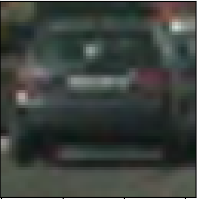
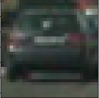
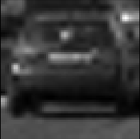
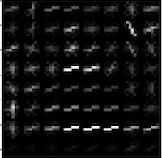
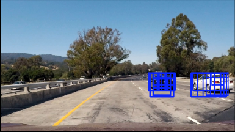
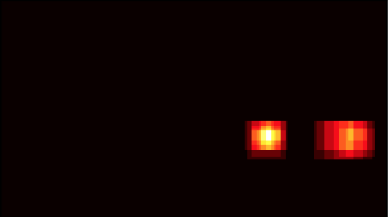
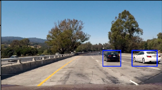

### Vehicle Detection and Tracking

#### Overview
Software pipeline to draw bounding-boxes around vehicles in a video from a front-facing camera on a car. There are multiple ways to implement this object detection pipeline. I will explore two ways (1) Classification using sliding window + HOG / Color Features (2) Regression by generating bounding box coordinates directly from CNN

#### Classifcation Pipeline using Sliding Window with HOG and Color Features
The pipeline has the follow steps:
* Perform spatial binning, and compute color histogram and Histogram of Oriented Gradients (HOG) feature extraction on a labeled training set of images and train a Linear SVM classfier on these features (images taken from GTI vehicle image dataset, the KITTI vision benchmark suite, and the Udacity highway videos)
* For each image in the video: 
  * Identify region of interest (lower half of image), and compute HOG features on the ROI. 
  * Search the ROI with sliding windows at 3 scales to account for differences in vehicle size resulting from various distances. For each window:
    * Sub-sample the HOG array for the current window
    * Perform spatial binning and compute color histogram features
    * Stack spatial binned, color, and HOG features together and use the SVM classifier to make a prediction. If the prediction is positive, use the current window positoin and size to draw a rectangle on the original image, and add "heat" to the heatmap
  * After the sliding window technique has been applied at all 3 window sizes, combine the heatmap for the current image with the heatmaps from the previous 8 frames. Then apply a heatmap threshold to combined heatmap, and draw bounding boxes around each vehicle 

Example training image 

 

Spatial Binning 

Color Histogram using Y channel from YCrCb color space. 

HOG

Results of sliding window search. Many duplicates for each car creates more "heat" on the heatmap. 

   

Labels are applied to the heatmap and final bounding boxes are drawn

   

