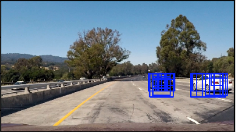

# Vehicle Detection and Tracking

## Overview
Software pipeline using traditional CV techniques to detect and draw bounding-boxes around vehicles in a video from a front-facing camera on a car. First, train a linear Support Vector Machine classifier on extracted features to identify car vs not-car. Then, process each frame of video using a sliding window technique, the trained classifier, and vehicle detections from previous frames. 

Images taken from GTI vehicle image dataset, the KITTI vision benchmark suite, and the Udacity highway videos

## Train Classifier

Example training image 

 

### 1. Spatial Binning
Use OpenCV function resize() to resize the image to 32x32px, and ravel() to transform into a 1-dimensional feature vector

### 2. Color histogram
Y channel from YCrCb color space

### 3. Histogram of Oriented Gradients (HOG)
Use OpenCV to compute HOG signature for each image. This consists in computing gradient magnitudes and directions for each pixel, then summing magnitudes for 8x8 cells. The result is a HOG signature for a car that can used to train a classifier. 

### 4. Train classifier
Train Linear SVM Classifier

## Process Video Frames

### 1. Region of interest
Because we only expect cars to appear on the road, the lower half of the image frame serves as the region of interest (ROI). Compute HOG features on the ROI. Computing the HOG features once saves computation in the window sliding step, because no HOG features need be computed for every window.

### 2. Sliding windows
Search the region of interest at 3 different window sizes - 32x32, 64,64, 96x96. For each window:
* Sub-sample the HOG array for the current window
* Perform spatial binning and compute color histogram features
* Stack spatial binned, color, and HOG features together and use the SVM classifier to make a prediction. If the prediction is positive, use the current window positoin and size to draw a rectangle on the original image, and add "heat" to the heatmap

Results of sliding window search. Many duplicates for each car creates more "heat" on the heatmap. 

   

### 3. Combine previous heatmaps and draw final bounding box
After the sliding window technique has been applied at all 3 window sizes, combine the heatmap for the current image with the heatmaps from the previous 8 frames. Then apply a heatmap threshold to combined heatmap, and draw bounding boxes around each vehicle 

Labels are applied to the heatmap and final bounding boxes are drawn

   

## Dependencies

* Python 3
* OpenCV
* Numpy
* matplotlib
* Jupyter Notebook

Note: Udacity has a handy Anaconda environment that includes many of the dependencies used in the Self-Driving Car Nanodegree: [CarND Term1 Starter Kit](https://github.com/udacity/CarND-Term1-Starter-Kit/blob/master/README.md)

## Running the code 
The project is completed in a Jupyter notebook. 
To start Jupyter in your browser, run the following command at the terminal prompt and within your Python 3 environment:

`> jupyter notebook`

